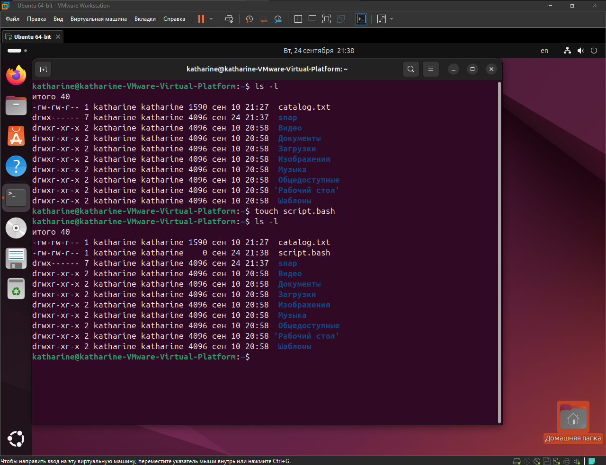
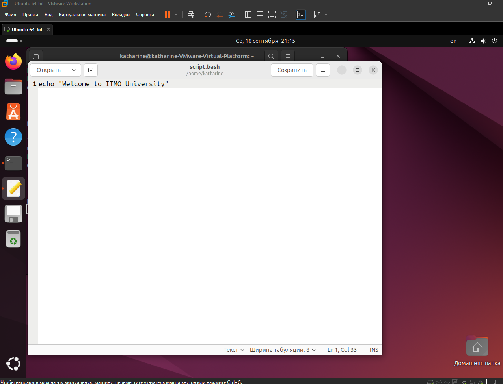
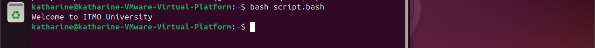
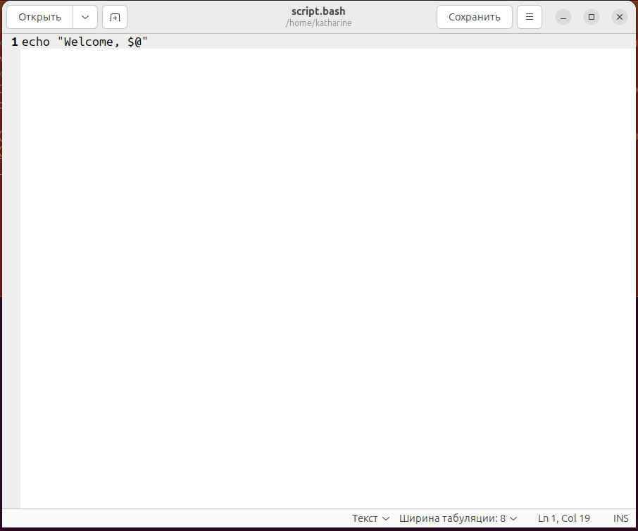
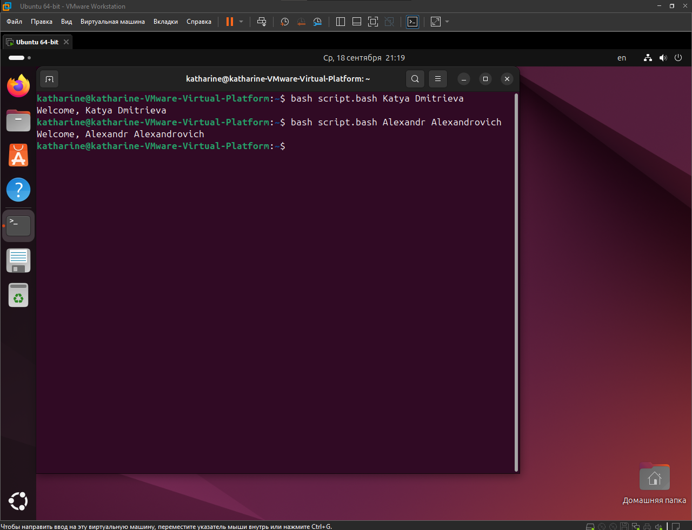
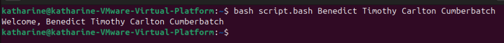

# Лабораторная 1
В начале я проверила наличие файла на диске и работу команды touch: <br><br>
*Ввела:* ```touch script.bash``` <br><br>
 <br><br>
Через файловый редактор gedit открыла файл: ```gedit script.bash``` <br>
и написала,что нужно было по заданию:<br><br>
 <br><br>
Используя команду ```bash script.bash```, я вывела содержимое файла на экран:<br><br>
 <br><br>
Отредактировала файл, используя спец. символ $@ (@ - обрабатывает и возвращает *все* введённые аргументы):<br><br>
 <br><br>
 <br><br>
 
